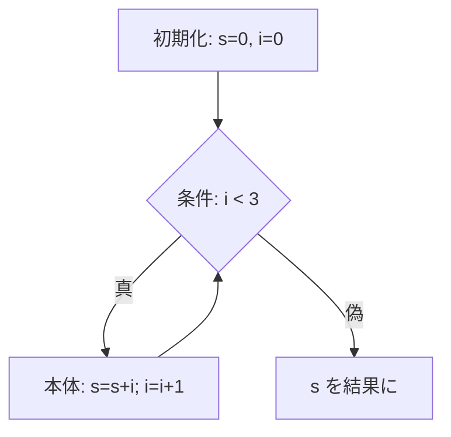

# 制御構造のコード生成

前章では、上から下へ一直線に流れるプログラムをコンパイルしました。この章では
`if` や `while` のように、条件によって実行する場所を変えたり、同じ場所を繰り返したり
する**制御構造**を扱います。木を素直にたどるだけでは表せない「飛ぶ」流れを、
ラベルとジャンプという道具でどう実現するかを見ていきます。

## ジャンプとラベル：流れを曲げる道具

`if` も `while` も、突き詰めれば「条件に応じて、次に実行する命令を選ぶ」ことです。
これを実現する命令が**ジャンプ（jump）**です。ジャンプとは、命令列の決まった位置へ
実行を移す命令のことです。移り先の位置を指すために**ラベル（label）**——命令列中の
名前付きの目印——を使います。

本書のスタックマシンに、次の命令を追加します。まず条件判定のための比較命令、
そしてジャンプ命令です。

| 命令 | 動作 |
|------|------|
| `lt` / `eq` | スタック上位2つを取り出し、`a < b` / `a == b` の結果（真なら1、偽なら0）を積む |
| `jump L` | 無条件にラベル `L` の位置へ飛ぶ |
| `branch_unless L` | スタックのてっぺんを取り出し、それが偽（0）ならラベル `L` へ飛ぶ |

`branch_unless` は「条件が成り立たなければ飛ぶ」命令です。「成り立つときに飛ぶ」
ではなく「成り立たないときに飛ぶ」のが、`if` 文のコード生成では便利になります。
理由はすぐあとで分かります。

ラベルをどう実装するかですが、本書では2段階に分けます。コード生成中は `L0`, `L1` の
ような**仮のラベル名**を使い、命令列に `[:label, "L0"]` という目印を埋め込んで
おきます。最後に、その目印が命令列の何番目にあるかを調べて、ジャンプ先を実際の
位置（インデックス）に置き換えます。この置き換え作業を**バックパッチ（backpatching）**
と呼びます [Aho et al., 2006](#cite:aho2006)。コード生成の時点では飛び先の位置が
まだ分からないことが多いため、後から穴を埋めるこのやり方が広く使われます。

VM 側も、ラベルとジャンプを解釈できるように拡張します。

```ruby
class VM
  def run(insns, num_locals)
    # まず label の位置（インデックス）を集める
    labels = {}
    insns.each_with_index do |(op, arg), i|
      labels[arg] = i if op == :label
    end

    stack  = []
    locals = Array.new(num_locals, 0)
    pc = 0                                 # プログラムカウンタ（今いる命令の位置）
    while pc < insns.size
      op, arg = insns[pc]
      case op
      when :label       then # 目印なので何もしない
      when :push_int    then stack.push(arg)
      when :load_local  then stack.push(locals[arg])
      when :store_local then locals[arg] = stack.pop
      when :add then b, a = stack.pop, stack.pop; stack.push(a + b)
      when :sub then b, a = stack.pop, stack.pop; stack.push(a - b)
      when :mul then b, a = stack.pop, stack.pop; stack.push(a * b)
      when :lt  then b, a = stack.pop, stack.pop; stack.push(a <  b ? 1 : 0)
      when :eq  then b, a = stack.pop, stack.pop; stack.push(a == b ? 1 : 0)
      when :jump          then pc = labels[arg]; next
      when :branch_unless then (pc = labels[arg]; next) if stack.pop == 0
      when :pop then stack.pop
      end
      pc += 1
    end
    stack
  end
end
```

**プログラムカウンタ（pc）**は「いま何番目の命令を実行しているか」を表す変数です。
普段は1ずつ増えますが、ジャンプ命令はこの pc を飛び先の位置に書き換えます。これが
「流れが曲がる」ことの正体です。

## if 文をコードにする

`if 条件 then 本体1 else 本体2` を考えます。AST は `[:if, 条件, 本体1, 本体2]` と
表すことにします。これを命令列にするときの定石は次の形です。

```
        （条件を評価してスタックに積む命令）
        branch_unless L_else   # 条件が偽なら else へ飛ぶ
        （本体1の命令）
        jump L_end             # then を実行したら end へ飛び越す
L_else:
        （本体2の命令）
L_end:
```

条件が**偽のときに else へ飛ぶ**ので、比較命令の結果をそのまま `branch_unless` に
渡せます。これが先ほど「成り立たないときに飛ぶ命令が便利」と述べた理由です。
また、`then` の本体を実行し終えたら、`else` の本体を**飛び越して** `L_end` へ
ジャンプしなければならない点にも注意してください。これを忘れると、`then` のあとに
`else` まで続けて実行されてしまいます。

Ruby で実装します。ラベル名が重複しないよう、通し番号で新しいラベルを作る
`new_label` を用意します。

```ruby
class Compiler
  def new_label
    @label_count ||= 0
    "L#{@label_count += 1}"
  end

  def gen(node)
    case node[0]
    # （前章までの int, var, assign, seq, 四則演算は省略）
    when :lt, :eq
      gen(node[1]); gen(node[2])
      emit(node[0])
    when :if
      l_else = new_label
      l_end  = new_label
      gen(node[1])                 # 条件
      emit(:branch_unless, l_else)
      gen(node[2])                 # then 本体
      emit(:jump, l_end)
      emit(:label, l_else)
      gen(node[3])                 # else 本体
      emit(:label, l_end)
    end
  end
end
```

コード生成の構造が、先ほどの定石の図と一行ずつ対応していることを確認してください。
条件・本体は `gen` を再帰的に呼ぶだけで、そこに必要なラベルとジャンプを織り込んで
いるのが要点です。

## while 文と後方ジャンプ

`while 条件 do 本体` を `[:while, 条件, 本体]` で表します。`while` の定石は次のように、
ループの先頭に戻る**後方ジャンプ**を使います。

```
L_begin:
        （条件を評価してスタックに積む命令）
        branch_unless L_end    # 条件が偽ならループを抜ける
        （本体の命令）
        jump L_begin           # 先頭に戻って条件を再評価
L_end:
```

`if` との違いは、本体の最後で**前に**（`L_begin` へ）戻るジャンプがあることです。
この後方ジャンプによって、条件が成り立つ限り本体が繰り返されます。

```ruby
when :while
  l_begin = new_label
  l_end   = new_label
  emit(:label, l_begin)
  gen(node[1])                 # 条件
  emit(:branch_unless, l_end)
  gen(node[2])                 # 本体
  emit(:jump, l_begin)
  emit(:label, l_end)
```

「カウンタ `i` を0から数え、合計 `s` を求める」プログラムでループを試します。

```ruby
# s = 0; i = 0; while i < 3 do s = s + i; i = i + 1 end; s
ast = [:seq,
  [:assign, "s", [:int, 0]],
  [:assign, "i", [:int, 0]],
  [:while, [:lt, [:var, "i"], [:int, 3]],
    [:seq,
      [:assign, "s", [:add, [:var, "s"], [:var, "i"]]],
      [:assign, "i", [:add, [:var, "i"], [:int, 1]]]]],
  [:var, "s"]]

insns, nlocals = Compiler.new.compile(ast)
p VM.new.run(insns, nlocals)
# => [3]      （0 + 1 + 2 = 3）
```

`while` ループが正しく回り、`0 + 1 + 2 = 3` が得られました。`if` と `while` という
代表的な制御構造を、どちらも「条件の評価 + ラベル + ジャンプ」の組み合わせで
表現できることが見えてきたと思います。

## 短絡評価：論理演算は制御構造である

最後に、初学者が見落としがちな点を扱います。`&&`（かつ）や `||`（または）といった
論理演算は、単なる演算ではなく**制御構造**だということです。

多くの言語で `a && b` は、`a` が偽ならば `b` を**評価しません**。これを**短絡評価
（short-circuit evaluation）**と呼びます。たとえば `x != 0 && 100 / x > 1` で、
`x` が0なら右側のゼロ除算を避けられるのは短絡評価のおかげです。つまり `&&` は
「左を評価し、その結果によって右を評価するかどうかを決める」——まさに `if` と
同じ分岐なのです。

そのため `a && b` のコード生成は、足し算のように両辺を評価してから演算するのでは
なく、`if` のようにジャンプを使って書きます。

```ruby
when :and
  l_end = new_label
  gen(node[1])               # 左辺を評価
  emit(:dup)                 # 結果を複製（判定用と最終結果用）
  emit(:branch_unless, l_end) # 左が偽なら、その偽値を残して終了
  emit(:pop)                 # 左が真なら複製を捨て、
  gen(node[2])               # 右辺の値を全体の結果とする
  emit(:label, l_end)
```

ここでは新たに `dup`（スタックのてっぺんを複製する命令）を使いました。VM 側への
追加は `when :dup then stack.push(stack.last)` の1行です。左辺の結果を
**判定にも最終結果にも**使いたいためです。左辺が偽ならその偽の値が全体の結果に
なり、右辺は評価されません。左辺が真なら、複製を捨てて右辺の値を結果とします。
`||` も同様に、左辺が真なら短絡するよう対称的に書けます。

> [!IMPORTANT]
> 「`&&` は演算子だから両辺を計算してから判定すればよい」と考えると、短絡評価の
> 仕様を壊してしまいます。論理演算子のコード生成は分岐として扱う、と覚えて
> ください。これは言語の意味（セマンティクス）を正しく保つために欠かせません。

## 基本ブロックと制御フローグラフ

制御構造を扱えるようになったので、ここで第3部の最適化につながる重要な概念を
紹介しておきます。**基本ブロック（basic block）**と**制御フローグラフ（control
flow graph, CFG）**です。

基本ブロックとは、「途中に分岐の入り口も出口もない、ひとかたまりの命令列」のことです。
言い換えると、先頭から入ったら必ず最後まで順に実行され、ジャンプは末尾にしか現れず、
飛び込まれるのは先頭だけ、という命令のまとまりです。先ほどの `while` の命令列は、
ジャンプとラベルを境目にして、いくつかの基本ブロックに分けられます。

それらの基本ブロックを節点とし、「この基本ブロックの次にどの基本ブロックへ進みうるか」
を矢印で結んだ図が制御フローグラフです。先ほどの `while` ループは次のような CFG に
なります。



CFG は、プログラムの実行が取りうる経路を一望できるデータ構造です。第3部で扱う
多くの最適化——たとえば「どの変数がどこで生きているか」を調べる解析——は、この
CFG の上で行われます [Cooper and Torczon, 2011](#cite:cooper2011)。いまは「制御
構造を命令列に落とすと、その裏側には CFG という構造が現れる」ことを覚えておいて
ください。

次章では、プログラムをいくつかの部品に分ける仕組み——関数のコード生成へ進みます。
