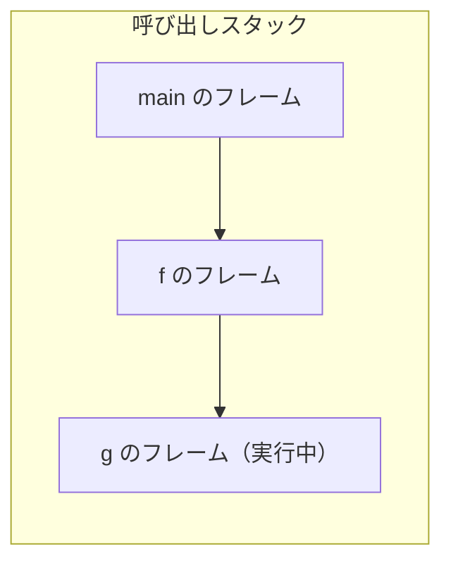

# 関数のコード生成

プログラムを部品に分け、名前を付けて何度も呼び出せるようにする仕組みが**関数**
（手続き、サブルーチン）です。この章では、関数の定義と呼び出しをどうコードに
するかを扱います。ここで登場する**呼び出し規約**や**スタックフレーム**という考え方は、
スタックマシンでも実マシンでも本質的に同じであり、第2部への橋渡しにもなります。

## 関数呼び出しに必要なこと

`f(2, 3)` のように関数を呼ぶとき、舞台裏では次のことを順に行う必要があります。

1. **引数を渡す**：呼ぶ側が計算した値（`2` と `3`）を、呼ばれる側へ受け渡す。
2. **制御を移す**：いま実行している場所を覚えたうえで、関数本体の先頭へ飛ぶ。
3. **戻り先を覚える**：関数が終わったら、呼び出した直後の位置へ戻れるようにする。
4. **戻り値を返す**：関数が計算した結果を、呼んだ側へ受け渡す。
5. **局所変数を分離する**：関数 `f` の中の変数と、呼んだ側の変数を混ぜない。

とくに5番目が重要です。`f` の中で使う変数 `x` と、`f` を呼んだ側の `x` は別物で
なければなりません。さらに、関数は自分自身を呼ぶ（**再帰**）こともあり、その場合
同じ関数の変数が同時に何セットも必要になります。この「呼び出しごとに独立した
変数の置き場」を実現するのが、次に述べるスタックフレームです。

## スタックフレームと呼び出しスタック

関数を呼ぶたびに作られる、その呼び出し専用の作業領域を**スタックフレーム（stack
frame）**または**活性化レコード（activation record）**と呼びます
[Appel, 1998](#cite:appel1998)。フレームには、その関数のローカル変数や引数、
戻り先の情報などが入ります。

関数呼び出しは入れ子になります。`main` が `f` を呼び、`f` が `g` を呼ぶと、3つの
フレームが必要です。そして `g` が終わると `g` のフレームは捨てられ、`f` に戻ります。
この「最後に作ったものを最初に捨てる」性質は、まさにスタックそのものです。そこで、
フレームをスタックに積み下ろしして管理します。これを**呼び出しスタック（call
stack）**と呼びます。



> [!NOTE]
> 「スタックがあふれる」エラー（stack overflow）を聞いたことがあるかもしれません。
> あれは、再帰が止まらずにフレームを積みすぎ、呼び出しスタックの容量を超えた状態です。
> フレームがスタックに積まれる仕組みを知ると、この現象の意味がよく分かります。

## 呼び出し規約：誰が何をするかの取り決め

関数を呼ぶ側（呼び出し元, caller）と呼ばれる側（呼び出し先, callee）は、別々に
コンパイルされるかもしれません。それでも正しく連携するには、「引数はどこに置くか」
「戻り値はどこに返すか」「フレームは誰が片付けるか」といったルールを**あらかじめ
決めておく**必要があります。この取り決めを**呼び出し規約（calling convention）**と
呼びます [Cooper and Torczon, 2011](#cite:cooper2011)。

本書のスタックマシンでは、次の単純な規約を採用します。

- **引数渡し**：呼ぶ側は、引数を左から順に計算してスタックに積んでから呼び出す。
- **戻り値**：関数は結果を1つだけスタックに残して戻る。
- **ローカル変数**：呼び出しごとに新しいフレームを作り、その中にローカル変数を置く。
  引数も、フレームの最初のローカル変数として受け取る。

これを実現するため、命令を追加します。

| 命令 | 動作 |
|------|------|
| `call f, n` | 関数 `f` を、スタック上の `n` 個の引数で呼ぶ。新しいフレームを作る |
| `ret` | スタックのてっぺんを戻り値として、呼び出し元のフレームへ戻る |

## VM に関数呼び出しを実装する

VM を、複数の関数とフレームを扱えるように作り直します。プログラムは「関数名 →
（命令列, 引数の個数, ローカル変数の個数）」の対応表として表すことにします。
実行は `main` 関数から始めます。

```ruby
class VM
  Frame = Struct.new(:insns, :locals, :pc, :labels)

  def initialize(program)
    @program = program          # 関数名 => { insns:, nargs:, nlocals: }
  end

  def make_frame(name, args)
    fn = @program[name]
    locals = Array.new(fn[:nlocals], 0)
    args.each_with_index { |v, i| locals[i] = v }   # 引数を先頭スロットへ
    labels = {}
    fn[:insns].each_with_index { |(op, a), i| labels[a] = i if op == :label }
    Frame.new(fn[:insns], locals, 0, labels)
  end

  def run
    stack = []
    frames = [make_frame("main", [])]              # 呼び出しスタック

    until frames.empty?
      fr = frames.last
      op, arg = fr.insns[fr.pc]
      case op
      when :label       then # 何もしない
      when :push_int    then stack.push(arg)
      when :load_local  then stack.push(fr.locals[arg])
      when :store_local then fr.locals[arg] = stack.pop
      when :add then b, a = stack.pop, stack.pop; stack.push(a + b)
      when :sub then b, a = stack.pop, stack.pop; stack.push(a - b)
      when :mul then b, a = stack.pop, stack.pop; stack.push(a * b)
      when :lt  then b, a = stack.pop, stack.pop; stack.push(a < b ? 1 : 0)
      when :eq  then b, a = stack.pop, stack.pop; stack.push(a == b ? 1 : 0)
      when :jump          then fr.pc = fr.labels[arg]; next
      when :branch_unless then (fr.pc = fr.labels[arg]; next) if stack.pop == 0
      when :call
        name, n = arg                              # arg は [関数名, 引数の数]
        args = stack.pop(n)                        # 引数 n 個を取り出す
        fr.pc += 1                                 # 戻ったとき呼び出しの次から再開
        frames.push(make_frame(name, args))        # 新しいフレームを積む
        next
      when :ret
        frames.pop                                 # 自分のフレームを捨てる
        next                                       # 戻り値は stack に残したまま
      end
      fr.pc += 1
    end
    stack
  end
end
```

ポイントは3つです。第一に、各フレームが**自分専用の `locals` と `pc`** を持つこと。
これでローカル変数が呼び出しごとに分離され、再帰も自然に扱えます。第二に、`call` が
新しいフレームを積み、`ret` がそれを捨てること。第三に、**引数の受け渡しは共有の
`stack` を通じて行う**こと。呼ぶ側が積んだ引数を、呼ばれる側がフレームの先頭スロット
で受け取り、戻り値も同じ `stack` に残して返します。なお `call` の前に `fr.pc += 1`
して戻り先を進めておくのは、関数から戻ったときに呼び出し命令の**次**から再開する
ためです（戻り先を覚える、の実装）。

## 関数のコード生成

コンパイラ側も、関数定義 `[:func, 名前, 引数名の配列, 本体]` と関数呼び出し
`[:call, 名前, 引数式の配列]` を扱えるようにします。関数ごとにシンボルテーブルを
作り直す点に注意してください。`f` のスロット0と `g` のスロット0は別のフレームの
別の変数なので、関数をまたいで番号を共有してはいけません。

```ruby
class Compiler
  def compile_program(funcs)
    program = {}
    funcs.each do |_, name, params, body|
      @insns  = []
      @locals = {}
      params.each { |p| slot_for(p) }   # 引数を先頭スロットに登録
      gen(body)                         # 本体は最後に値を1つ残す前提
      emit(:ret)
      program[name] = { insns: @insns, nargs: params.size,
                        nlocals: @locals.size }
    end
    program
  end

  def gen(node)
    case node[0]
    # （これまでの int, var, assign, seq, 制御構造などは省略）
    when :call
      name, args = node[1], node[2]
      args.each { |a| gen(a) }            # 引数を左から順に積む
      emit(:call, [name, args.size])     # 戻り値が1つスタックに残る
    end
  end
end
```

引数を `params.each { slot_for }` で先頭スロットに登録しておくのは、VM 側で引数を
フレームの先頭ローカルとして受け取る規約に合わせるためです。コンパイラと VM が
**同じ呼び出し規約を共有している**からこそ、両者は正しく噛み合います。

再帰関数の定番、階乗を計算してみましょう。`fact(n) = if n < 2 then 1 else n *
fact(n-1)` です。

```ruby
funcs = [
  [:func, "fact", ["n"],
    [:if, [:lt, [:var, "n"], [:int, 2]],
      [:int, 1],
      [:mul, [:var, "n"],
        [:call, "fact", [[:sub, [:var, "n"], [:int, 1]]]]]]],
  [:func, "main", [],
    [:call, "fact", [[:int, 5]]]],
]

program = Compiler.new.compile_program(funcs)
p VM.new(program).run
# => [120]      （5! = 120）
```

`fact(5)` が `120` になりました。VM の中では、`fact` が自分自身を呼ぶたびに新しい
フレームが積まれ、`n` が `5, 4, 3, 2, 1` と別々のフレームに保持され、`ret` で
ひとつずつ畳まれながら結果が掛け合わされていきます。スタックフレームの仕組みが、
再帰を素直に支えていることが分かります。

## まとめと実マシンへの接続

この章で扱った概念は、スタックマシン特有のものに見えるかもしれませんが、実は
実マシン（CPU）でもほぼそのまま当てはまります。

- 実マシンにも**呼び出しスタック**があり、メモリ上に伸び縮みするスタック領域として
  実現されています。
- 引数や戻り値、戻り先アドレスの置き場所は、CPU ごとに**呼び出し規約**で厳密に
  定められています。本書では「全部スタック経由」という単純な規約にしましたが、
  実際の規約では速度のため、最初の数個の引数を**レジスタ**で渡すのが普通です。
- 「呼び出しの前後でどのレジスタの値が壊れてもよいか」もまた呼び出し規約の一部
  です。これは第2部のレジスタ割り付けと深く関わります
  [Cooper and Torczon, 2011](#cite:cooper2011)。

ここまでの第1部で、変数・式・制御構造・関数という、プログラミング言語の主要な
要素のコード生成をひととおり経験しました。第2部では、これまで「抽象的なスタック
マシン」で済ませてきた部分を、現実の CPU——レジスタマシンに向けて作るときに
立ちはだかる問題へと踏み込みます。
