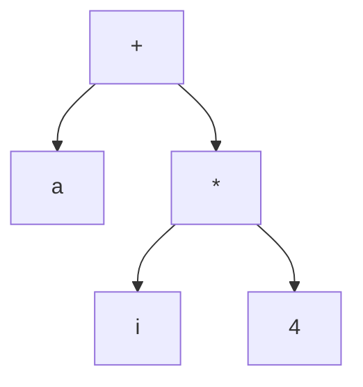

# 命令選択

第1部では、抽象的なスタックマシンに向けてコードを生成しました。スタックマシンの
命令は「足し算は `add`」のように、ほぼ1対1で AST のノードに対応していたので、
どの命令を使うかで悩むことはありませんでした。しかし実マシン（CPU）が相手になると
事情が変わります。同じ計算を実現する機械語の組み合わせが**何通りもある**のです。
そのなかから良いものを選ぶ仕事を**命令選択（instruction selection）**と呼びます。

## レジスタマシンとスタックマシンの違い

まず、相手が変わったことを確認します。現実の CPU は**レジスタマシン**です。
**レジスタ**とは、CPU の中にある、ごく少数（数十個程度）の高速な値の置き場です。
スタックマシンが「スタックのてっぺん」を暗黙のオペランドにしていたのに対し、
レジスタマシンの命令は、使うレジスタを**名前で明示**します。

たとえば「レジスタ `r1` と `r2` を足して `r3` に入れる」命令は、

```
add r3, r1, r2      # r3 <- r1 + r2
```

のように書きます。これは第2章で見た三番地コードにそっくりです。実際、三番地コードは
レジスタマシン向けコード生成の入力としてよく使われます。

レジスタマシンには、スタックマシンには無かった制約があります。**レジスタの数が
有限**だということです。スタックは（理屈のうえでは）いくらでも深く積めましたが、
レジスタは数十個しかありません。この有限性が、第2部のもうひとつの主題である
レジスタ割り付けを生みます。本章ではいったんレジスタは「いくつでも使える」仮の
ものとして扱い、命令の選び方に集中します。こうした個数無制限の仮想的なレジスタを
**仮想レジスタ（virtual register）**と呼びます。

## 同じ計算に複数の命令列がある

命令選択がなぜ「選択」なのかを、具体例で見ましょう。多くの CPU には、四則演算の
ような基本命令のほかに、複数の操作をまとめて行う**複合命令**があります。

たとえば配列 `a` の `i` 番目の要素のアドレスは、`a の先頭 + i × 要素サイズ` で
求まります。これを素朴な命令だけで書くと、掛け算と足し算の2命令になります。

```
mul t1, ri, 4       # t1 <- i * 4
add t2, ra, t1      # t2 <- a + t1
```

ところが x86 のような CPU には、「ベースアドレス + 添字 × 定数」を**1命令で**
計算できるアドレッシングモードがあります。すると同じ計算が、

```
lea t2, [ra + ri*4] # t2 <- a + i * 4 を1命令で
```

と書けてしまいます。どちらも結果は同じですが、後者のほうが命令数が少なく、
ふつうは速く小さくなります。「2命令の素朴な版」と「1命令の複合版」のどちらを
選ぶか——これが命令選択の問題です [Cooper and Torczon, 2011](#cite:cooper2011)。

> [!NOTE]
> 命令選択の良し悪しは、ターゲット CPU の命令セットに強く依存します。豊富な複合
> 命令を持つ CPU ほど選択の余地が大きく、選び方の巧拙が性能に効きます。逆に
> 命令が単純な CPU では、選択はやさしくなります。

## 木のタイル張りとしての命令選択

命令選択を体系的に考える有力な見方が、**木のタイル張り（tree tiling）**です
[Appel, 1998](#cite:appel1998)。

考え方はこうです。式を木構造の IR で表します。一方、CPU の各命令も「自分が実現
できる計算の形」を小さな木——**タイル**——として持っていると考えます。たとえば
`add` 命令は「2つの値を足す」という小さな木に対応します。先ほどの `lea` 命令は、
「足し算の右側に掛け算がぶら下がった」より大きな木に対応します。

命令選択とは、**IR の木全体を、これらのタイルで隙間なく覆い尽くす**ことだ、と
言い換えられます。床をタイルで敷き詰めるのに似ているので「タイル張り」と呼びます。
木の覆い方が決まれば、使ったタイル（＝命令）を適切な順に並べることで命令列が
得られます。



この木は、2枚の小さなタイル（`*` 用と `+` 用）で覆うこともできれば、`lea` に対応する
1枚の大きなタイルで一気に覆うこともできます。覆い方が複数あるからこそ、選択が
必要になるわけです。

## 最大限の食いつき：貪欲なタイル張り

もっとも単純な選び方は、**できるだけ大きなタイルを優先して当てはめる**やり方です。
木の根から見て、その場所に当てはまる最大のタイルを貪欲に選び、覆えなかった部分木に
ついて同じことを繰り返します。この方針を**最大限の食いつき（maximal munch）**と
呼びます [Appel, 1998](#cite:appel1998)。

Ruby で、ごく小さなタイル張り器を書いてみましょう。`lea` 相当の複合パターンを
優先的に当て、当たらなければ素朴な2命令に分解します。生成器が新しい仮想レジスタを
払い出しながら、命令列を組み立てます。

```ruby
class Selector
  def initialize
    @insns = []
    @vreg_count = 0
  end

  def new_vreg
    "t#{@vreg_count += 1}"          # 仮想レジスタを払い出す
  end

  def emit(text)
    @insns << text
  end

  # 木 node を覆い、結果が入った（仮想）レジスタ名を返す
  def select(node)
    case node
    # 大きいタイル: (+ base (* idx const)) を lea 1命令で覆う
    in [:add, base, [:mul, idx, [:const, c]]]
      rb = select(base)
      ri = select(idx)
      dst = new_vreg
      emit("lea #{dst}, [#{rb} + #{ri}*#{c}]")
      dst
    # 小さいタイル: 一般の足し算
    in [:add, l, r]
      rl, rr = select(l), select(r)
      dst = new_vreg
      emit("add #{dst}, #{rl}, #{rr}")
      dst
    in [:mul, l, r]
      rl, rr = select(l), select(r)
      dst = new_vreg
      emit("mul #{dst}, #{rl}, #{rr}")
      dst
    in [:var, name]
      name                          # 変数はそのままレジスタ名として扱う
    in [:const, c]
      dst = new_vreg
      emit("mov #{dst}, #{c}")
      dst
    end
  end

  def run(node)
    @insns = []
    select(node)
    @insns
  end
end
```

ここでは Ruby の**パターンマッチ**（`case ... in`、Ruby 3.0 以降）を使って、木の形を
そのまま条件に書いています。`[:add, base, [:mul, idx, [:const, c]]]` という節が、
「足し算の右が掛け算で、その右が定数」という大きなタイルに対応します。この節を
一般の `[:add, l, r]` より**先に**置くことで、当てはまるときは必ず大きなタイルが
優先されます。これが maximal munch の実装です。

`a + i * 4` を流してみます。

```ruby
ast = [:add, [:var, "a"], [:mul, [:var, "i"], [:const, 4]]]
Selector.new.run(ast).each { |i| puts i }
# => lea t1, [a + i*4]
```

狙いどおり、掛け算と足し算が `lea` 1命令にまとまりました。もし大きなタイルの節を
外せば、`mul` と `add` の2命令に分解されます。タイルの優先順位を変えるだけで、
生成される命令列が変わる——これが命令選択の働きです。

## 良いタイル張りを選ぶ：コストと動的計画法

maximal munch は単純で高速ですが、「いちばん大きいタイル」が「いちばん速いタイル」
とは限りません。命令ごとに実行コスト（速度や命令長）が違うからです。そこで、各
タイルにコストを割り当て、**木全体のコストが最小になる覆い方**を選ぶ、という
最適化問題として定式化できます。

驚くことに、この最小コストのタイル張りは**動的計画法（dynamic programming）**で
効率よく解けます。動的計画法とは、大きな問題を小さな部分問題に分け、部分問題の
最適解を表にためて使い回す手法です。木の各節点について「この部分木を、結果をどこに
置く形で覆うと最小コストか」を葉から根へ計算していけば、全体の最適解が求まります。
この理論は[Aho and Johnson, 1976](#cite:aho1976)が確立しました。

さらに実用上は、このコスト計算を毎回手で書くのではなく、命令セットの記述（タイルと
コストの一覧）から**命令選択器を自動生成する**ツールが使われます。代表的なものに
BURG 系のツールがあり、[Fraser et al., 1992](#cite:fraser1992)の iburg はその
コンパクトな実装としてよく知られています。LLVM のような大規模なコンパイラ基盤も、
内部に命令選択の仕組みを備えています [Lattner and Adve, 2004](#cite:lattner2004)。

> [!TIP]
> 「貪欲法（maximal munch）」と「動的計画法による最適化」は、命令選択における
> 速さと質のトレードオフの典型例です。実装が簡単で速い貪欲法か、最適だが手間の
> かかる動的計画法か——コンパイラの目的（高速なコンパイルか、高速な実行コードか）に
> 応じて選ばれます。

## まとめ

- 実マシンはレジスタマシンであり、命令はレジスタを名前で指定する。
- 同じ計算を実現する機械語の組み合わせは複数あり、その中から選ぶのが命令選択。
- 命令選択は「IR の木をタイルで覆う」問題として整理できる。
- 単純な方針は貪欲な最大限の食いつき、質を求めるならコスト付きの動的計画法で
  最適なタイル張りを求める。

本章では、レジスタを「いくつでも使える仮想レジスタ」として扱ってきました。しかし
実際の CPU のレジスタは有限です。次章では、無限に使った仮想レジスタを有限の物理
レジスタへ押し込める——レジスタ割り付けの問題を扱います。
