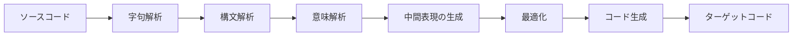
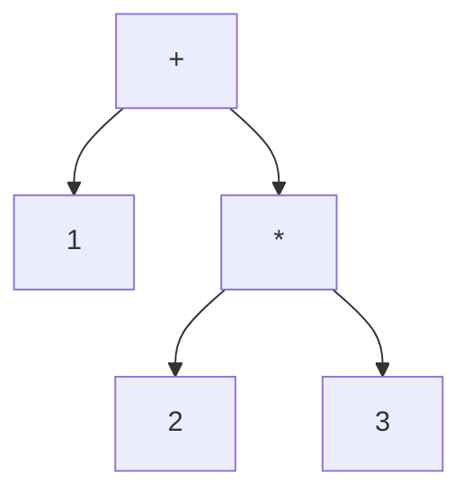

# コード生成とは何か

この章では、本書が扱う「コード生成」がコンパイラ全体のどこに位置するのかを確認し、
本書を通じて使う言葉や題材をそろえます。まだコードは書きません。まずは地図を
手に入れることが目的です。

## コンパイラの全体像とコード生成の位置

**コンパイラ**とは、ある言語で書かれたプログラム（ソースコード）を、別の言語で
書かれた等価なプログラムへ変換するソフトウェアです。多くの場合、変換先は CPU が
直接実行できる**機械語**や、後述する仮想マシン向けの**バイトコード**です。

コンパイラの内部は、伝統的にいくつかの段階（フェーズ）に分けて説明されます
[Aho et al., 2006](#cite:aho2006)。



ここで使った用語を簡単に説明します。

- **字句解析（lexical analysis）**：文字の並びを、`if` や `123`、`+` といった
  意味のある最小単位（**トークン**）の列に分解する段階です。
- **構文解析（parsing）**：トークン列が言語の文法に合っているかを調べ、
  プログラムの構造を木の形に組み立てる段階です。この木が次に説明する AST です。
- **意味解析（semantic analysis）**：型の整合性や変数の宣言漏れなど、文法だけでは
  表せない規則を検査する段階です。

コンパイラの前半（字句解析・構文解析・意味解析）を**フロントエンド**、後半
（中間表現の生成・最適化・コード生成）を**バックエンド**と呼びます。本書が扱うのは、
おもにこのバックエンド側、とりわけ最後の**コード生成（code generation）**——
プログラムの構造から実際に動く命令列を作り出す部分——です。

> [!NOTE]
> 字句解析と構文解析は、それだけで一冊の本になるほど奥の深いテーマです。
> 本書ではこれらの結果である AST が「すでに手元にある」ところから話を始めます。
> フロントエンドに興味がある読者は[Aho et al., 2006](#cite:aho2006)や
> [Cooper and Torczon, 2011](#cite:cooper2011)を参照してください。

## 抽象構文木（AST）という出発点

**抽象構文木（Abstract Syntax Tree, AST）**は、プログラムの構造を木構造で表した
データです。「抽象」と付くのは、括弧やセミコロンといった**構文上は必要だが意味には
影響しない要素**を取り除き、計算の本質だけを残しているからです。

たとえば `1 + 2 * 3` という式を考えます。掛け算は足し算より先に計算されるので、
この式の構造は次のような木になります。



木のいちばん上（**根, root**）が最後に行われる演算、葉が具体的な値です。
このように、AST には**演算の順序**と**入れ子の構造**がそのまま反映されています。
コード生成の仕事は、ざっくり言えば「この木をどういう順番でたどれば、正しい
計算をする命令列が得られるか」を考えることだと言えます。

本書では、AST を Ruby のデータとして次のように表すことにします。配列の先頭に
ノードの種類を表すシンボルを置く、素朴な表現です。

```ruby
# 1 + 2 * 3 に対応する AST
[:add,
  [:int, 1],
  [:mul,
    [:int, 2],
    [:int, 3]]]
```

意味解析まで終わったあとの AST には、本来は変数の型や定義位置といった付加情報も
くっついていますが、コード生成の本質を見るうえでは上のような簡単な表現で十分です。
実際のコンパイラでは木のノードをクラスのオブジェクトで表すことが多く、その作り方は
[Appel, 1998](#cite:appel1998)や[Nystrom, 2021](#cite:nystrom2021)が詳しく
扱っています。

## ターゲット：何に向けてコードを出すのか

コード生成の話を始める前に、「何に向けて」コードを出すのかを決めておく必要が
あります。代表的なターゲットは次の2つです。

**仮想マシン（Virtual Machine, VM）向けのバイトコード。**
仮想マシンとは、物理的な CPU ではなく、ソフトウェアとして作られた「架空の計算機」
です。Java の JVM や、Ruby の処理系である YARV [Sasada, 2005](#cite:sasada2005)が
代表例です。仮想マシンが実行する命令列を**バイトコード**と呼びます。バイトコードは
特定の CPU に依存しないので、同じバイトコードをいろいろな環境で動かせるという
利点があります。

**実マシン（real machine）向けの機械語。**
x86-64 や ARM といった、実在する CPU が直接実行できる命令列を生成する方法です。
仮想マシンを経由しないぶん速く動きますが、CPU ごとに命令が違うため、コード生成は
ターゲットの種類だけ必要になります。

仮想マシンには、計算に使うデータを**スタック**（後入れ先出しの一時置き場）に
積んで処理する**スタックマシン**と、CPU のように名前付きの**レジスタ**を使う
**レジスタマシン**があります。本書では、まず仕組みが分かりやすいスタックマシンを
題材にコード生成の基礎を学び（第1部）、そのうえで実マシン（レジスタマシン）特有の
問題へ進みます（第2部）。

> [!TIP]
> 「VM 向けかネイティブ向けか」は二者択一ではありません。多くの現代的な処理系は、
> まずバイトコードを生成して仮想マシンで実行し、よく実行される部分だけを実行時に
> 機械語へコンパイルします。これが第3部で扱う**JIT コンパイル**です
> [Aycock, 2003](#cite:aycock2003)。

## 本書の進め方と題材の言語

本書では、概念を説明するだけでなく、小さな言語のコンパイラを Ruby で実際に
組み立てていきます。題材にする言語は、整数の計算・変数・`if`・`while`・関数だけを
持つ、ごく小さな手続き型言語です。この言語にはとくに名前を付けず、単に「対象言語」
と呼びます。

Ruby を使うのは、配列やハッシュ、シンボルといった機能のおかげで AST や命令列を
短く書けて、コード生成の本質に集中できるからです。Ruby そのものの処理系である
YARV もスタックマシンであり [Sasada, 2005](#cite:sasada2005)、本書で作る
スタックマシンとよく似た考え方で動いています。

各章では、次のような流れで話を進めます。

1. その章で解決したい問題を、対象言語の小さなプログラムを例に提示する。
2. 必要な概念と用語を説明する。
3. Ruby のコード生成器（コンパイラ）として実装する。
4. 生成された命令列を眺め、なぜそれで正しく動くのかを確認する。

それでは次の章で、AST と最終的な命令列の橋渡しをする**中間表現**から始めましょう。
