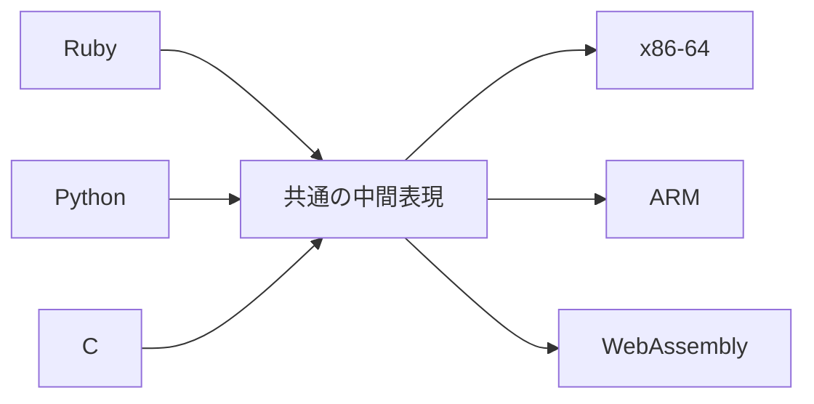

# 中間表現（IR）

前章で、コード生成とは「AST を命令列に変換すること」だと述べました。しかし実際の
コンパイラは、AST からいきなり最終的な機械語を作るとは限りません。多くの場合、
その間に**中間表現**と呼ばれるデータを挟みます。この章では、中間表現とは何か、
なぜ必要なのか、どんな種類があるのかを見ていきます。

## なぜ AST から直接機械語を作らないのか

中間表現の必要性は、「対応すべき組み合わせの数」を考えると分かりやすくなります。

世の中には複数のプログラミング言語があり（フロントエンドが複数）、複数の CPU が
あります（バックエンドが複数）。もし各言語から各 CPU へ直接コードを書こうとすると、
言語の数 × CPU の数だけのコード生成器が必要になります。3言語・4 CPU なら 12 通りです。

ここで、すべての言語がいったん共通の**中間表現（Intermediate Representation, IR）**に
変換され、すべての CPU 向けコード生成がその IR から出発するようにすると、必要な
部品は「言語の数 + CPU の数」に減ります。3 + 4 = 7 通りです。



この「真ん中でくびれた」構造を、形になぞらえて**砂時計モデル**と呼ぶことがあります。
実在する例が LLVM で、その中心にあるのが LLVM IR という中間表現です
[](#cite:lattner2004)。

中間表現にはもうひとつ重要な役割があります。それは**最適化を行う場所**になることです。
第3部で扱う多くの最適化は、特定の言語や CPU に依存しない形で書けると都合がよく、
そのためには言語にも機械にも縛られない中間表現が必要になります
[](#cite:cooper2011)。

> [!NOTE]
> 中間表現は1種類とは限りません。実際のコンパイラは、抽象度の高い IR から低い IR へ
> 段階的に降ろしていく（**lowering** と呼びます）構成をとることがよくあります。
> 高い IR は最適化しやすく、低い IR は機械語に近い、という使い分けです。

## 木構造の中間表現

もっとも抽象度の高い中間表現は、AST そのもの、あるいは AST に少し手を加えた
**木構造の IR** です。前章で見た `1 + 2 * 3` の表現がまさにこれにあたります。

木構造 IR の利点は、式の構造がそのまま見えることです。後の章で扱う命令選択
（どの機械語命令を使うか決める処理）は、木のパターンを照合しながら行うと自然に
書けるため、木構造 IR を入力にすることがよくあります
[](#cite:aho1976)。

一方で、木構造のままでは表しにくいものもあります。たとえば「途中で計算した値を
あとで2回使い回す」とか「`goto` のように離れた場所へ飛ぶ」といった、木の入れ子では
素直に書けない流れです。こうした流れを表すには、次に述べる線形な中間表現が向いて
います。

## 線形の中間表現：三番地コード

**線形の中間表現（linear IR）**は、命令を上から下へ一列に並べた表現です。これは
最終的な命令列に近い形であり、本書でメインに扱う表現でもあります。

線形 IR の代表が**三番地コード（three-address code）**です。名前のとおり、ひとつの
命令が最大で3つの「番地」（オペランド）——演算結果を入れる先1つと、計算に使う値2つ——
を持つ形式です [](#cite:aho2006)。各命令はちょうど1つの基本的な
演算だけを行います。

たとえば `x = 1 + 2 * 3` を三番地コードにすると、次のようになります。`t1`, `t2` は
コンパイラが計算の途中結果を入れるために作り出した**一時変数（temporary）**です。

```
t1 = 2 * 3
t2 = 1 + t1
x  = t2
```

木構造ではひとつの式だった `1 + 2 * 3` が、ここでは2つの演算命令に**ばらされて**
いる点に注目してください。複雑な式を「一度にひとつの演算」へと分解するこの作業は、
コード生成の本質的な一歩です。三番地コードまで分解できていれば、各命令を機械語の
1命令（や数命令）へ対応させるのは比較的容易になります。

## スタックベースの中間表現

本書の第1部で実際に生成するのは、3つめの形式である**スタックベースの中間表現**です。
これは、計算に使う値を**スタック**（後入れ先出しの一時置き場）に積んで処理する
仮想マシン向けの命令列です。

スタックベースの命令は、オペランドを名前で指定する代わりに「スタックのてっぺんから
取る」という約束で動きます。先ほどの `1 + 2 * 3` は次のようになります。

```
push_int 1
push_int 2
push_int 3
mul          # スタック上の 2 と 3 を取り出し、6 を積む
add          # スタック上の 1 と 6 を取り出し、7 を積む
```

`mul` 命令はオペランドをひとつも書いていませんが、「スタックのてっぺんにある2つの
値を掛けて、結果を積み直す」という意味が命令自体に決まっています。このため
スタックベースの命令列は、三番地コードより**さらにコンパクト**になります。一時変数の
名前を書かなくてよいからです。Java の JVM や Ruby の YARV
[](#cite:sasada2005)がこの方式を採っています。

3つの形式の関係を整理すると、次のようになります。

| 形式 | 例での表れ方 | 主な用途 |
|------|------|------|
| 木構造 IR | `[:add, 1, [:mul, 2, 3]]` | 命令選択、高水準の最適化 |
| 三番地コード | `t1 = 2 * 3; t2 = 1 + t1` | 一般的な最適化、レジスタ割り付け |
| スタックベース | `push; push; push; mul; add` | 仮想マシンのバイトコード |

> [!TIP]
> どの中間表現が「正しい」わけではありません。目的によって使い分けるものです。
> スタックベースは生成も実行も単純で VM 向き、三番地コードは最適化やレジスタ
> 割り付けに向き、木構造は命令選択に向く——という得意分野の違いを押さえて
> おきましょう。

## 静的単一代入（SSA）形式：少しだけ先取り

最後に、最適化と相性のよい中間表現として**静的単一代入（Static Single Assignment,
SSA）形式**の名前だけ挙げておきます。SSA とは、「すべての変数は、プログラム中で
ちょうど一度だけ代入される」という制約を課した三番地コードのことです。

たとえば次のように、同じ `x` に2回代入するコードを考えます。

```
x = 1
x = x + 2
```

SSA 形式では、代入のたびに新しい名前（`x1`, `x2`, ...）を割り当てます。

```
x1 = 1
x2 = x1 + 2
```

こうしておくと「ある変数の値がどこで作られたか」が名前を見るだけで一意に分かる
ようになり、多くの最適化が驚くほど簡単になります。SSA を効率的に作る方法は
[](#cite:cytron1991)が確立し、いまでは LLVM をはじめ多くの
コンパイラが採用しています。SSA については第3部「最適化」の章で改めて扱います。

次章からはいよいよ実装に入ります。まずは AST を走査してスタックベースの中間表現を
生成する、もっとも素直な方法を見ていきましょう。
