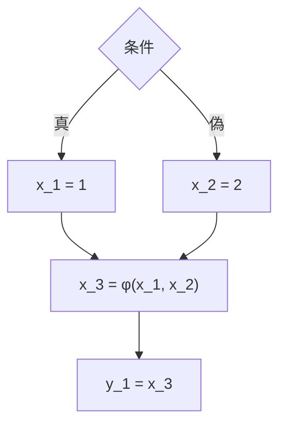

# コード最適化

ここまでで、正しく動くコードを生成できるようになりました。第3部では、その生成した
コードを**速く（または小さく）**するための工夫——**最適化（optimization）**を扱います。
最適化は奥が深く、それだけで何冊もの本があります [Muchnick, 1997](#cite:muchnick1997)。
この章では、初学者がまず押さえておきたい代表的な最適化を、考え方を中心に紹介します。

> [!IMPORTANT]
> 最適化の大原則は「**プログラムの意味を変えてはならない**」ことです。速くなっても
> 計算結果が変わってしまっては意味がありません。最適化は常に「結果が同じことを
> 保証できる範囲」でのみ行われます。この保証のために、コンパイラはさまざまな解析を
> 行います。

## のぞき穴最適化

もっとも素朴で分かりやすい最適化が**のぞき穴最適化（peephole optimization）**です
[McKeeman, 1965](#cite:mckeeman1965)。これは、生成された命令列を小さな窓（のぞき穴）で
少しずつ眺め、その範囲に現れた**無駄なパターン**を、等価でより短いパターンに
書き換える手法です。

たとえば、コード生成器が機械的に命令を出すと、次のような無駄が紛れ込むことが
あります。

```
store_local 0     # 変数 x に格納し、
load_local 0      # すぐ同じ変数 x を読み直している
```

格納した直後に同じ場所を読むのですから、読み直しは省けます（格納した値が
スタックに残るように `dup` を足せば等価です）。あるいは、

```
push_int 0
add               # 0 を足しても値は変わらない
```

`0` を足す命令は丸ごと削除できます。こうした「狭い範囲を見れば分かる無駄」を
パターンとして列挙し、機械的に潰していくのがのぞき穴最適化です。

Ruby で、ごく単純なのぞき穴最適化器を書いてみましょう。命令列を2命令ずつ眺め、
既知の無駄なパターンを書き換えます。

```ruby
def peephole(insns)
  result = []
  i = 0
  while i < insns.size
    a, b = insns[i], insns[i + 1]
    if a && b && a[0] == :push_int && a[1] == 0 && b[0] == :add
      # 「0 を足す」は何もしないのと同じ -> 2命令とも削除
      i += 2
    elsif a && b && a == [:push_int, 1] && b[0] == :mul
      # 「1 を掛ける」も削除
      i += 2
    else
      result << a
      i += 1
    end
  end
  result
end

p peephole([[:load_local, 0], [:push_int, 0], [:add], [:store_local, 1]])
# => [[:load_local, 0], [:store_local, 1]]
```

`+ 0` を表す2命令がきれいに消え、命令列が短くなりました。のぞき穴最適化は実装が
簡単なわりに効果があり、いまでもコンパイラの最終段でよく使われます。窓を機械語まで
降ろした段階で当てれば、命令選択やレジスタ割り付けが残した細かな無駄も拾えます。

## 定数畳み込みと定数伝播

**定数畳み込み（constant folding）**は、「コンパイル時に計算できる部分は、
コンパイル時に計算してしまう」最適化です。たとえば `2 * 3` のように、両辺が定数の
演算は、実行時に毎回計算する必要はなく、コンパイル時に `6` に置き換えられます。

これは AST や IR の上で、再帰的に行えます。「子が両方とも定数なら、その演算を
定数に畳む」だけです。

```ruby
def fold(node)
  case node[0]
  when :int
    node
  when :add, :sub, :mul
    l = fold(node[1])
    r = fold(node[2])
    if l[0] == :int && r[0] == :int   # 両辺が定数なら計算してしまう
      v = l[1].send({ add: :+, sub: :-, mul: :* }[node[0]], r[1])
      [:int, v]
    else
      [node[0], l, r]
    end
  else
    node
  end
end

p fold([:add, [:int, 1], [:mul, [:int, 2], [:int, 3]]])
# => [:int, 7]
```

`1 + 2 * 3` が、コードを生成する前に `7` という定数1つへ畳み込まれました。実行時に
足し算も掛け算もしなくて済みます。

定数畳み込みは、それ単体より**定数伝播（constant propagation）**と組み合わさると
強力になります。定数伝播とは、「ある変数が定数だと分かったら、その変数の使用箇所を
定数で置き換える」最適化です。

```
x = 3
y = x + 4
```

ここで定数伝播により `x + 4` は `3 + 4` になり、続けて定数畳み込みで `7` になります。
さらに `x` がもう使われないなら、最初の `x = 3` 自体が不要になります。最適化どうしが
連鎖して、コードがどんどん削れていく様子が分かるでしょう。この連鎖を逃さず行うには、
「どの変数がどこで定義され、どこで使われるか」を正確に追う必要があります。

## 共通部分式の除去と不要コードの除去

**共通部分式の除去（common subexpression elimination, CSE）**は、「同じ計算を
2回しているなら、1回だけ計算して結果を使い回す」最適化です。

```
a = (x + y) * 2
b = (x + y) * 3
```

`x + y` が2回現れています。途中で `x` や `y` が変わらないなら、`x + y` は一度だけ
計算して一時変数にとっておき、両方でそれを使えます。掛ける数が違うだけなので、
足し算を1回節約できます。

**不要コードの除去（dead code elimination, DCE）**は、「結果がどこでも使われない
計算を削除する」最適化です。先ほどの定数伝播のあとに残った `x = 3` のように、
代入したのに二度と読まれない変数への代入は、丸ごと消せます。

これらの最適化に共通するのは、いずれも「値がどこで作られ、どこで使われるか」という
**データの流れ**を正確に把握する必要がある、という点です。この把握を支えるのが、
次に述べる SSA 形式です。

## SSA 形式が最適化を支える

第2章で名前だけ紹介した**静的単一代入（SSA）形式**を、ここで改めて取り上げます。
SSA とは、「すべての変数は、プログラム中でちょうど一度だけ代入される」よう、代入の
たびに新しい名前を振った中間表現でした。

なぜ SSA が最適化に効くのでしょうか。鍵は、SSA では**変数名を見ただけで、その値が
どこで作られたか一意に分かる**ことです。普通の表現では、`y = x + 1` の `x` が
どの代入の `x` なのか、制御の流れをたどって調べなければなりません。SSA なら `x` は
`x_3` のように一意な名前になっているので、定義は文字どおり1か所に決まります。
これにより、定数伝播・共通部分式の除去・不要コード除去といった最適化が、複雑な
解析なしに素直に書けるようになります [Cytron et al., 1991](#cite:cytron1991)。

ただし、ひとつ問題があります。`if` で分かれた道が合流する場所では、変数の値が
「どちらの道を通ってきたか」によって変わります。

```
if 条件 then x = 1 else x = 2 end
y = x            # ここの x は、x=1 と x=2 のどちら？
```

SSA で `x = 1` を `x_1`、`x = 2` を `x_2` と名付けると、合流後の `x` は `x_1` でも
`x_2` でもありえます。これを表すために、SSA は**φ関数（ファイ関数）**という特別な
擬似命令を導入します。合流点に `x_3 = φ(x_1, x_2)` と書き、「どちらの道から来たかに
応じて、対応する値を選ぶ」ことを表します。



φ関数を制御フローグラフのどこに、最小限の数だけ置けばよいか——これを効率的に
求める方法を確立したのが[Cytron et al., 1991](#cite:cytron1991)の有名な仕事で、
今日の LLVM をはじめ多くのコンパイラ基盤が SSA を中心に据えています
[Lattner and Adve, 2004](#cite:lattner2004)。最終的にコードを生成する前には、
φ関数を実際のコピー命令へ戻す（SSA から抜ける）処理が行われます。

## 最適化はいつ・どこで行うか

最後に、これらの最適化が**どの中間表現の上で**行われるかを整理しておきます。

- 定数畳み込みは、AST のような高水準の表現でも、低水準の IR でも行えます。
- 定数伝播・CSE・DCE は、三番地コードや SSA 形式の上で行うのが定石です。
- のぞき穴最適化は、機械語に近い低水準の命令列の上で最後に行うと効果的です。

つまり、最適化はコンパイルの一か所でまとめて行うものではなく、抽象度の異なる複数の
段階で、それぞれに向いた最適化を行っていくものです [Cooper and Torczon, 2011](#cite:cooper2011)。

> [!TIP]
> 最適化には「やりすぎ」もあります。最適化自体に時間がかかれば、コンパイルが遅く
> なります。また、最適化が複雑になるほどバグも入りやすくなり、それは「速いが間違った
> コード」という最悪の結果を招きます。どこまで最適化するかは、つねに費用対効果の
> 判断です。

次章では、コンパイル時ではなく**プログラムの実行中に**コードを生成・最適化する、
JIT コンパイルの世界を見ていきます。
