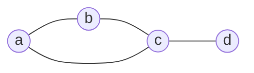

# レジスタ割り付け

前章では、命令選択のあいだレジスタを「いくつでも使える」仮想レジスタとして扱い
ました。しかし現実の CPU が持つレジスタはせいぜい数十個です。仮想レジスタが
それより多くなることはざらにあります。そこで、無限に使った仮想レジスタを有限の
**物理レジスタ**へ割り当て直す処理が必要になります。これが**レジスタ割り付け
（register allocation）**です。コンパイラのバックエンドで、生成コードの速度を
もっとも大きく左右する処理のひとつです [](#cite:cooper2011)。

## なぜレジスタ割り付けが要るのか

レジスタは、メモリに比べて桁違いに速くアクセスできる値の置き場です。計算に使う値が
レジスタに載っていれば命令はすぐ実行できますが、レジスタに載りきらない値は
**メモリ（スタック上のフレーム）**に退避させ、使うたびに読み書きしなければなりません。
メモリアクセスはレジスタアクセスより遅いので、これが頻発するとプログラムは遅く
なります。

したがってレジスタ割り付けの目標は、「できるだけ多くの値をレジスタに載せ続け、
メモリへの退避を最小限にする」ことです。値をメモリへ退避することを**スピル（spill）**と
呼びます。スピルはレジスタが足りないときの最後の手段であり、これをいかに減らすかが
腕の見せどころです。

## 生存区間と干渉

割り付けを考える前に、「2つの変数が**同じレジスタを共有してよいか**」を判断する
基準が要ります。鍵になるのが**生存区間（live range）**という概念です。

ある変数が「生きている（live）」とは、**いまその変数に入っている値が、この先で使われる
可能性がある**状態を指します。値が代入されてから最後に使われるまでが、その変数の
生存区間です。最後の使用を過ぎれば、その値はもう要らない——つまりその変数は
「死んだ」とみなせます。

ここで重要な観察です。**生存区間が重ならない2つの変数は、同じレジスタを共有できる**。
一方が死んでから他方が生き始めるなら、レジスタを使い回しても困らないからです。逆に、
ある時点で同時に生きている2つの変数は、別々のレジスタが要ります。同じレジスタに
入れたら一方の値が壊れてしまうからです。この「同時に生きているので同じレジスタに
できない」関係を**干渉（interference）**と呼びます。

どの変数がどこで生きているかを調べる解析を**生存解析（liveness analysis）**と
いい、第4章で触れた制御フローグラフ（CFG）の上で、使用箇所から定義箇所へ向かって
情報を伝播させることで求めます [](#cite:muchnick1997)。本章では
生存区間はすでに分かっているものとして、その先の割り付けに進みます。

## グラフ彩色としてのレジスタ割り付け

干渉の関係は、**グラフ**で表すと見通しがよくなります。変数を節点とし、互いに干渉
する（同時に生きている）2変数を辺で結んだグラフを**干渉グラフ（interference
graph）**と呼びます。

すると、レジスタ割り付けは次の問題に翻訳されます。

> 干渉グラフの各節点に「色」（＝物理レジスタ）を塗りたい。ただし、辺で結ばれた
> 節点どうしは違う色にしなければならない。使える色は $k$ 個（＝物理レジスタの数）
> である。$k$ 色で塗り分けられるか？

これは**グラフ彩色（graph coloring）**という有名な問題そのものです。辺で結ばれた
節点（＝干渉する変数）を異なる色（＝異なるレジスタ）にする、という制約が、まさに
「干渉する変数は別レジスタ」という要請と一致します。レジスタ割り付けをグラフ彩色
として定式化したのは Chaitin らの古典的な仕事です
[](#cite:chaitin1982)。



たとえばこの干渉グラフで、`a`・`b`・`c` は互いに干渉しあう三角形なので、3色とも
別々でなければなりません。一方 `d` は `c` としか干渉しないので、`a` や `b` と
同じ色を使い回せます。つまりこのグラフは3色で塗れます。物理レジスタが3個以上あれば
スピルせずに割り付けられる、ということです。

## Chaitin のアルゴリズム：簡略化と彩色

一般のグラフを $k$ 色で塗れるか判定する問題は計算が難しい（NP完全）ことが知られて
いますが、Chaitin らは実用的によく働く近似アルゴリズムを与えました
[](#cite:chaitin1982)。中心となるのは、次の素朴な観察です。

> **次数が $k$ 未満の節点は、必ず塗れる。**
> その節点には隣が $k-1$ 個以下しかいないので、$k$ 色あれば隣と違う色が必ず残る。

そこで、次のように進めます。

1. **簡略化（simplify）**：次数が $k$ 未満の節点をグラフから取り除き、スタックに
   積む。取り除くと残りの節点の次数が下がるので、これを繰り返す。
2. グラフが空になるまで続ける。
3. **彩色（select）**：スタックから節点を逆順に取り出し、グラフに戻しながら、
   その時点で隣と衝突しない色を割り当てる。簡略化の順序のおかげで、戻すときには
   必ず空いている色がある。

途中で「次数が $k$ 未満の節点がもう無い」状態に陥ったら、$k$ 色では塗りきれない
可能性があります。そのときは節点をひとつ選んでスピル候補とし、グラフから外して
先へ進みます（**潜在的スピル**）。実際に色が割り当てられなければ、その変数はメモリへ
退避する、すなわちスピルが確定します。

Ruby で、スピルを伴わない簡単な版を実装してみましょう。

```ruby
class GraphColoring
  def initialize(graph, k)
    @graph = graph            # { 節点 => 隣接節点の集合(Set) }
    @k = k                    # 使える色（レジスタ）の数
  end

  def allocate
    stack = []
    g = deep_copy(@graph)

    # 1. 簡略化: 次数 < k の節点を順に取り除いてスタックへ
    until g.empty?
      node = g.keys.find { |n| g[n].size < @k }
      node ||= g.keys.first   # 候補が無ければスピル候補を外す（簡略版）
      stack.push(node)
      g.each_value { |adj| adj.delete(node) }
      g.delete(node)
    end

    # 2. 彩色: 逆順に戻しながら、隣と衝突しない色を割り当てる
    color = {}
    stack.reverse_each do |node|
      used = @graph[node].map { |nb| color[nb] }.compact
      chosen = (0...@k).find { |c| !used.include?(c) }
      color[node] = chosen    # nil ならスピル
    end
    color
  end

  def deep_copy(g)
    g.each_with_object({}) { |(n, adj), h| h[n] = adj.dup }
  end
end
```

先ほどの干渉グラフを3色（レジスタ3個）で割り付けてみます。

```ruby
require "set"
graph = {
  "a" => Set["b", "c"],
  "b" => Set["a", "c"],
  "c" => Set["a", "b", "d"],
  "d" => Set["c"],
}
p GraphColoring.new(graph, 3).allocate
# => {"d" => 0, "c" => 1, "b" => 0, "a" => 2}  （どの色番号が割り当たるかは実装依存）
```

`a`・`b`・`c` は互いに干渉するので別々の色（`2`・`0`・`1`）になり、`d` は `c` と
しか干渉しないので `c` 以外の色を使い回せました（ここでは `b` と同じ `0`）。3個の
レジスタにきれいに収まったわけです。もしレジスタが2個
（`k = 2`）なら、三角形 `a`-`b`-`c` を塗りきれず、どれかがスピルすることになります。

## スピルとさらなる改良

スピルが避けられないとき、どの変数を退避するかの選び方も性能を左右します。よく
使われるのは「生存区間が長く、ループの中であまり使われない変数を優先して退避する」
といったヒューリスティックです。頻繁に使う値をスピルしてしまうと、メモリアクセスが
増えてかえって遅くなるからです。

また、スピルを決めたら終わりではありません。退避先への store と、使う場所での
reload の命令を実際に挿入すると、命令列が変わり、生存区間も変わります（reload で
作られる短い区間が新たに生まれます）。そのため Chaitin の方式では、スピル挿入後に
**生存解析・干渉グラフ構築・彩色をやり直し**、全員に色が付くまでこの繰り返しを
続けます。レジスタ割り付けは一発で終わる処理ではなく、反復的な処理なのです。

実マシンに適用するときは、さらに二つの現実が加わります。一つは**事前彩色
（precolored）**の節点です。呼び出し規約で「引数は最初にこのレジスタ」「戻り値は
このレジスタ」と決まっている値は、最初から色（物理レジスタ）が固定された節点として
干渉グラフに参加します。もう一つは **move の合体（coalescing）**です。`mov a, b` の
両辺を同じレジスタに割り付けられれば、その move 自体を消せます。ただし合体しすぎると
グラフが塗りにくくなるため、安全な場合だけ合体するヒューリスティックが使われます。

Chaitin の方式には改良が重ねられてきました。なかでも[](#cite:briggs1994)の
**楽観的彩色（optimistic coloring）**は重要です。これは「$k$ 色未満の節点が無く
なっても、すぐにスピル確定とせず、いったんスタックに積んでみる。彩色の段階で本当に
色が無かったときだけスピルする」という考え方です。簡略化の段階では塗れないように
見えても、実際に戻してみると隣が同じ色を使い回していて塗れることがあるためです。
この一手間で、スピルの回数を実際に減らせることが示されています。

> [!NOTE]
> ここで紹介したグラフ彩色は古典的な手法ですが、現在も実用コンパイラの土台です。
> 一方、第3部で触れる SSA 形式の上では干渉グラフが特別な性質（弦グラフ）を持つことが
> 知られ、より高速・高品質な割り付け手法の研究につながっています。レジスタ割り付けは
> いまも活発な研究テーマです。

## まとめ

- 物理レジスタは有限なので、仮想レジスタを物理レジスタへ割り当て直す必要がある。
- 同時に生きている（干渉する）変数は別レジスタにしなければならない。生存解析で
  これを求める。
- 干渉グラフを作れば、レジスタ割り付けは「$k$ 色でのグラフ彩色」になる。
- Chaitin のアルゴリズムは、次数の低い節点から簡略化し、逆順に色を塗ることで
  実用的に彩色する。塗れない変数はメモリへスピルする。
- 楽観的彩色などの改良でスピルを減らせる。

これで第2部「実マシンを意識する」は終わりです。命令選択とレジスタ割り付けという、
実マシン向けコード生成の2大テーマを見てきました。第3部では、ここまでで作れる
ようになった「正しく動くコード」を、さらに**速く**するための最適化と実行時
コンパイルの世界へ進みます。
