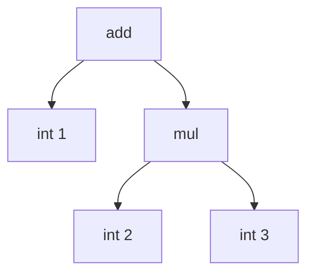

# 木をたどってコードを出す

この章が本書の心臓部です。AST という木構造を**たどり（走査し）**ながら、
スタックマシン向けの命令列を出力する、もっとも基本的なコード生成の方法を、
Ruby で実際に組み立てます。式の計算から始めて、変数と代入まで扱えるようにします。

## 題材とするスタックマシン

まず、コードを出力する相手——スタックマシンの仕様を決めます。前章で見たように、
スタックマシンは計算用の値を積み下ろしする**スタック**を持つ仮想マシンです。
本書では、次の命令を持つ小さなスタックマシンを対象にします。命令はあとの章で
少しずつ増やしていきます。

| 命令 | 動作 |
|------|------|
| `push_int n` | 整数 `n` をスタックに積む |
| `load_local i` | `i` 番目のローカル変数の値をスタックに積む |
| `store_local i` | スタックのてっぺんを取り出し、`i` 番目のローカル変数に格納する |
| `add` / `sub` / `mul` / `div` | スタック上位2つを取り出し、演算結果を積む |
| `pop` | スタックのてっぺんを捨てる |

**ローカル変数**は、名前ではなく**番号（スロット番号）**で指定することにします。
これは実際の仮想マシンでも一般的なやり方で、変数名を整数の通し番号に置き換えて
おくと、実行時に名前を文字列で探す必要がなくなり高速になります。名前から番号への
対応づけは、コンパイル時にコンパイラが行います。

スタックマシンの動きを確かめられるよう、Ruby で簡単な実行器（インタプリタ）も
用意しておきましょう。命令列を上から順に解釈するだけの素朴なものです。

```ruby
class VM
  def run(insns, num_locals)
    stack  = []
    locals = Array.new(num_locals, 0)
    insns.each do |op, arg|
      case op
      when :push_int    then stack.push(arg)
      when :load_local  then stack.push(locals[arg])
      when :store_local then locals[arg] = stack.pop
      when :add then b, a = stack.pop, stack.pop; stack.push(a + b)
      when :sub then b, a = stack.pop, stack.pop; stack.push(a - b)
      when :mul then b, a = stack.pop, stack.pop; stack.push(a * b)
      when :div then b, a = stack.pop, stack.pop; stack.push(a / b)
      when :pop then stack.pop
      else raise "unknown op: #{op}"
      end
    end
    stack          # 残ったスタックを返す（確認用）
  end
end
```

各命令を `[:push_int, 1]` のように「シンボルと引数の組」で表しています。引数が
要らない `add` などは `[:add]` とします。減算で `b, a = stack.pop, stack.pop` と
**逆順**に取り出しているのは、先に積んだほうが左側のオペランド（`a - b` の `a`）に
なるようにするためです。この順序は後の章でも効いてくるので覚えておいてください。

## 後行順走査：木をたどる順番

では、AST から上の命令列をどう作るのでしょうか。鍵は**走査する順番**です。

もう一度 `1 + 2 * 3` の木を見てみましょう。



スタックマシンの `add` は「スタックに2つの値が積まれている」ことを前提とします。
つまり `add` の命令を出す**前に**、左右の子の値を計算する命令を出し終えていなければ
なりません。一般化すると、「あるノードの命令を出すには、先に子ノードの命令をすべて
出しておく」必要があります。

このように「子を先に、自分を後に」処理する木の走査順を**後行順走査（post-order
traversal）**と呼びます。コード生成は、本質的にこの後行順走査です。上の木を後行順で
たどると、

1. `int 1` を訪れる → `push_int 1`
2. `int 2` を訪れる → `push_int 2`
3. `int 3` を訪れる → `push_int 3`
4. `mul` を訪れる（子は処理済み）→ `mul`
5. `add` を訪れる（子は処理済み）→ `add`

となり、前章で見た命令列がそのまま得られます。スタックマシンとコード生成の相性が
よいのは、この後行順走査がスタックの積み下ろしと自然に一致するからです。

## 式のコード生成を実装する

後行順走査の考え方を Ruby のコードにします。AST の各ノードを訪れて命令を出す
メソッドを `gen` と名づけ、ノードの種類で処理を振り分けます。出力した命令は
`@insns` という配列にためていきます。

```ruby
class Compiler
  def initialize
    @insns = []
  end

  def emit(op, arg = nil)   # 命令を1つ出力する
    @insns << (arg.nil? ? [op] : [op, arg])
  end

  def gen(node)
    case node[0]
    when :int
      emit(:push_int, node[1])
    when :add, :sub, :mul, :div
      gen(node[1])                       # 左の子を先に（後行順）
      gen(node[2])                       # 右の子を先に（後行順）
      emit(node[0])                      # 最後に自分（ノード種別＝命令名にしてある）
    else
      raise "unknown node: #{node[0]}"
    end
  end

  def compile(node)
    @insns = []
    gen(node)
    @insns
  end
end
```

`gen` が**再帰的に自分を呼び出している**ところが核心です。`add` ノードを処理する
ときは、まず `gen(node[1])` で左の子の命令を出し切り、次に `gen(node[2])` で右の子の
命令を出し切り、最後に自分の `add` を出します。再帰呼び出しが戻ってきた時点では、
子の計算結果がスタックに積まれている、という約束が常に守られます。

実際に動かしてみましょう。

```ruby
ast = [:add, [:int, 1], [:mul, [:int, 2], [:int, 3]]]

insns = Compiler.new.compile(ast)
p insns
# => [[:push_int, 1], [:push_int, 2], [:push_int, 3], [:mul], [:add]]

p VM.new.run(insns, 0)
# => [7]
```

`1 + 2 * 3` がきちんと `7` になりました。AST を後行順にたどるだけで、正しい計算を
する命令列が機械的に得られたことが確認できます。この「再帰で木をたどりながら命令を
吐く」構造は、本書を通じて何度も登場します。

> [!NOTE]
> この素直な方式は、複雑な式に対しては最適とは限りません。たとえば「左右どちらの
> 子を先に評価すれば、計算の途中結果を置く場所（スタックの深さやレジスタの数）を
> 最小にできるか」という問題には、古くから知られた最適解があります
> [](#cite:aho1976)。本書ではまず素直な方式を理解し、
> こうした最適化は第3部以降の話題とします。

## 変数と代入を加える

数値を計算できるようになったので、次は**変数**を扱えるようにします。対象言語では
変数への代入を `[:assign, "x", 式]`、変数の参照を `[:var, "x"]` と表すことにします。
また、文を上から順に並べたものを `[:seq, 文1, 文2, ...]` で表します。

ここで問題になるのが、本章の最初の節で触れた**スロット番号**です。スタックマシンは変数を
名前ではなく番号で扱うので、コンパイラは「`x` は0番、`y` は1番」のような対応表を
作り、名前が出てくるたびに番号へ変換しなければなりません。この変数名から
スロット番号への対応表を**シンボルテーブル**（記号表）と呼びます。

```ruby
class Compiler
  def initialize
    @insns = []
    @locals = {}     # 変数名 -> スロット番号 のシンボルテーブル
  end

  # 変数のスロット番号を返す。未登録なら新しい番号を割り当てる
  def slot_for(name)
    @locals[name] ||= @locals.size
  end

  def gen(node)
    case node[0]
    when :int
      emit(:push_int, node[1])
    when :var
      emit(:load_local, slot_for(node[1]))
    when :assign
      gen(node[2])                          # 右辺を計算してスタックに積む
      emit(:store_local, slot_for(node[1])) # それを変数スロットへ格納
    when :seq
      node[1..].each { |stmt| gen(stmt) }   # 文を順に処理
    when :add, :sub, :mul, :div
      gen(node[1]); gen(node[2])
      emit(node[0])
    else
      raise "unknown node: #{node[0]}"
    end
  end

  def compile(node)
    @insns = []
    gen(node)
    [@insns, @locals.size]                  # 命令列と必要なスロット数を返す
  end
end
```

`slot_for` は、まだ番号を割り当てていない変数名に出会ったら、その時点での登録数を
新しい番号として払い出します（`@locals.size` は0始まりの通し番号になります）。
`assign` の処理は、前章の三番地コードの分解と同じ考え方です。まず右辺を評価して
結果をスタックに積み、それを `store_local` で変数スロットへ移します。

`x = 10; y = x + 5; y` というプログラムをコンパイルしてみましょう。対象言語の
AST では次のように書けます。

```ruby
ast = [:seq,
  [:assign, "x", [:int, 10]],
  [:assign, "y", [:add, [:var, "x"], [:int, 5]]],
  [:var, "y"]]

insns, nlocals = Compiler.new.compile(ast)
insns.each { |i| p i }
# => [:push_int, 10]
#    [:store_local, 0]      # x（スロット0）へ
#    [:load_local, 0]       # x を読む
#    [:push_int, 5]
#    [:add]
#    [:store_local, 1]      # y（スロット1）へ
#    [:load_local, 1]       # 最後に y を読む

p VM.new.run(insns, nlocals)
# => [15]
```

変数 `x` がスロット0、`y` がスロット1に割り当てられ、最後にスタックへ残った値が
`15` になりました。名前の管理（シンボルテーブル）と木の後行順走査を組み合わせる
だけで、変数を含むプログラムのコード生成ができたわけです。

## まとめ

この章では、コード生成のもっとも基本的な技法を学びました。

- スタックマシンの値はスタックに積み下ろしされる。
- AST を**後行順**にたどると、スタックマシン向けの正しい命令列が得られる。
- コード生成器は、ノードの種類で処理を振り分けながら**再帰的に**木をたどる関数
  として書ける。
- 変数は名前のままでは扱わず、シンボルテーブルで**スロット番号**に変換する。

ここまでで扱ったのは、上から下へ一直線に流れるプログラムだけでした。しかし
実際のプログラムには `if` や `while` のように、流れが分岐したり後戻りしたりする
構造があります。木の後行順走査だけでは、こうした「飛ぶ」流れは表現できません。
次章では、ラベルとジャンプを導入して制御構造のコード生成に挑みます。
